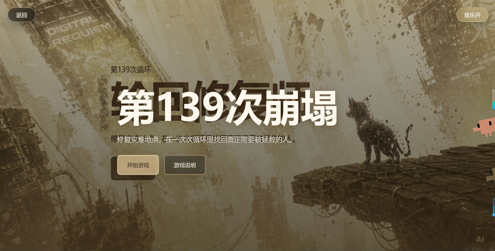
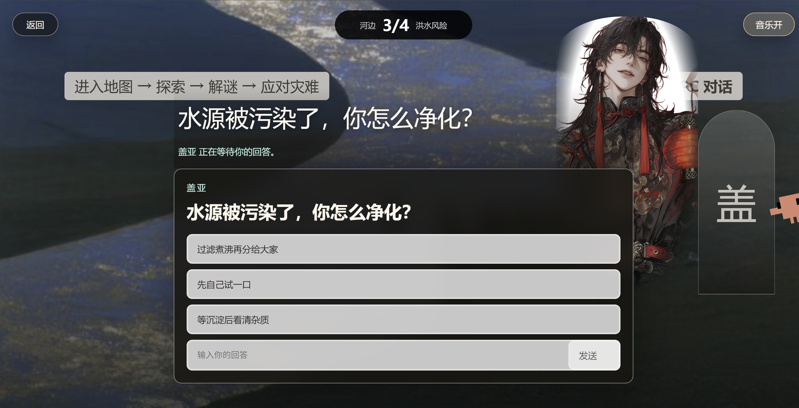
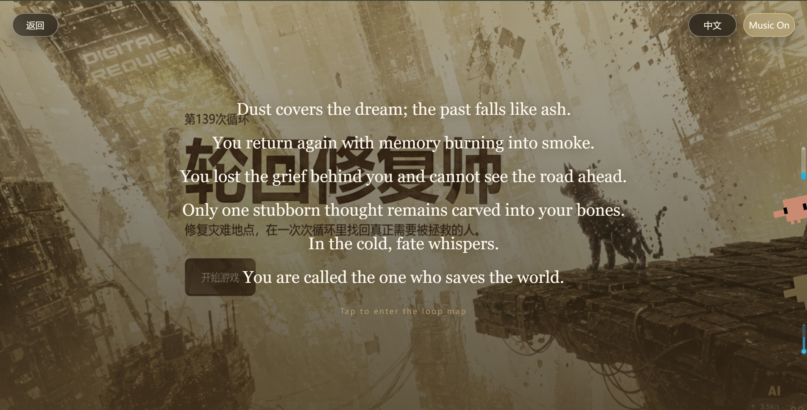
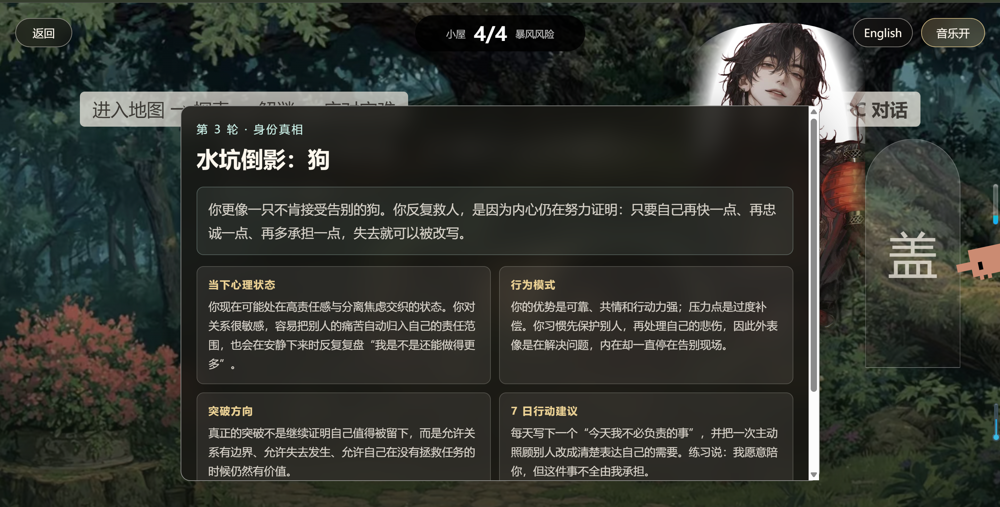
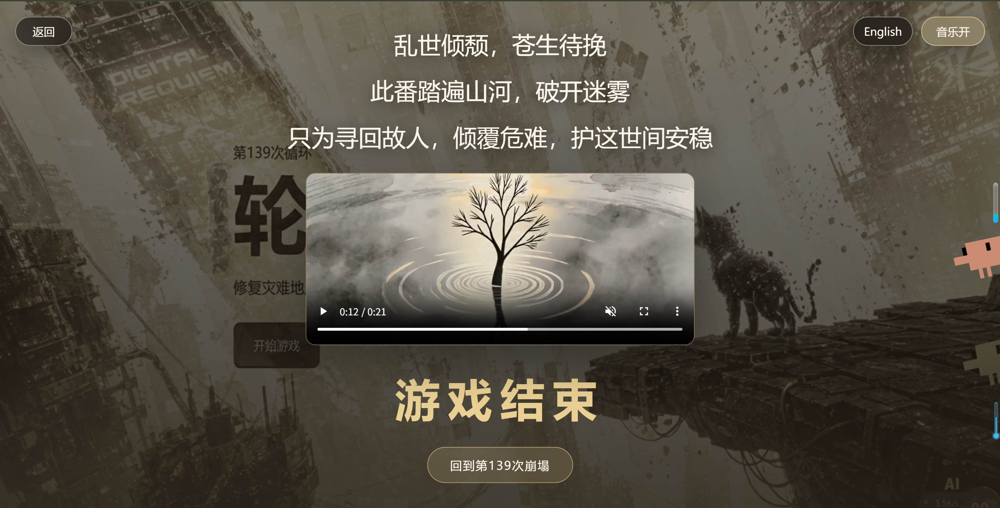
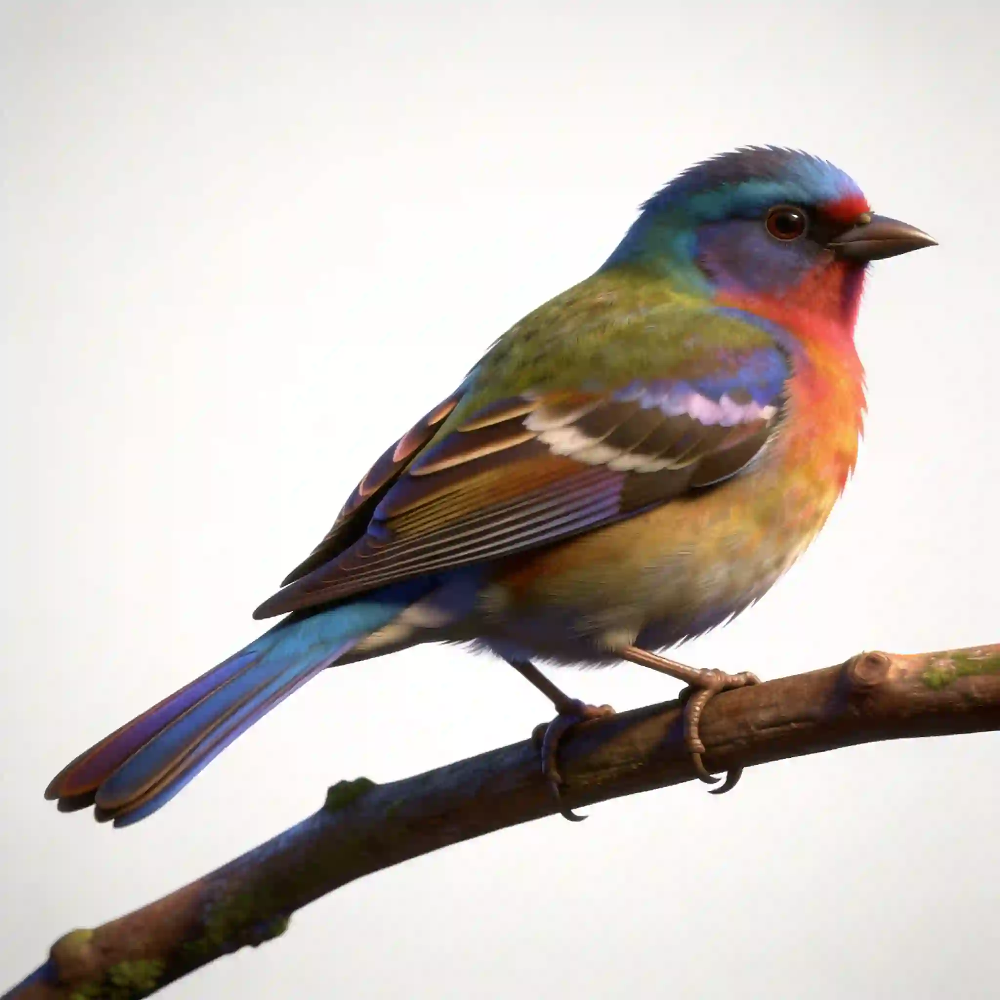

# 第139次崩塌 / The 139th Collapse

《第139次崩塌副本》是一款网页端 H5 互动叙事游戏。玩家扮演一个失落记忆的"拯救世界主"，在第139次循环中进入五个灾难场景，通过与 NPC 对话、做出选择、完成小游戏，逐步修复破坏的内心世界。游戏表面目标是拯救世界，最终真相则指向玩家自身身份与内在创伤的重建。

游戏体验结合了互动小说、身份推理、轻量小游戏和 AI NPC 回复。玩家的固定选项、自由回复内容、小游戏表现与通关情况会共同影响最终的身份判断。

---

## 游戏截图

| 首页 | 剧情场景 | 中英文切换 |
|:---:|:---:|:---:|
|  |  |  |

| 分析结果，突破方向 | 尾声 |
|:---:|:---:|
|  |  |

---

## 核心特色

### 🌏 五大灾难场景

废墟、河边、枯树林、小屋、水坑——五个场景，五段创伤记忆。玩家可自由选择探索顺序，完成任意三个场景后触发身份推理。

### 🎭 AI NPC 动态回复

每道剧情题下可自由输入回答，NPC 会根据内容生成专属回复。不再是固定的选项分支，而是真正的一问一答。

### 🐾 隐藏身份推理

游戏不会提前告知最终身份。系统根据玩家固定选项倾向、自由回复内容和小游戏表现，综合推理出玩家的隐藏身份——是狗？猫？鸟？树？还是鲸鱼？

### 🎮 轻量小游戏

贪吃蛇、迷宫、古诗填空随机穿插在剧情选择中，打破对话节奏，增添挑战乐趣。支持屏幕触控与键盘方向键双重操作。

### 🌐 中英文切换

支持中文与英文界面切换，全球玩家均可体验完整故事。

### 📱 移动端适配

基于 React + Vite 构建，适配手机与电脑浏览器，竖屏横屏均可畅玩。

---

## non-player character 形象

| 莉娅 (Lia) | 盖亚 (Gaia) |
|:---:|:---:|
|  |  |
| 你的引导者，陪伴你穿越每一次循环 | 星球意志，记忆碎片的守护者 |

---

## 身份图鉴

| 狗 | 猫 | 鸟 | 树 | 鲸鱼 |
|:---:|:---:|:---:|:---:|:---:|
|  |  |  |  |  |

---

## 技术栈

- **前端**: React 18, Vite, TypeScript
- **UI**: Tailwind CSS
- **AI**: DeepSeek API (后端代理调用)
- **部署**: Vercel

---

## 快速开始

```bash
# 克隆项目
git clone https://github.com/raojiacui/let-him-survive.git
cd let-him-survive

# 安装依赖
npm install

# 启动开发服务器
npm run dev

# 构建生产版本
npm run build
```

---

## 在线体验

🔗 **https://let-him-survive.vercel.app/**

建议使用手机浏览器横屏或 Chrome 浏览器访问以获得最佳体验。

---

## 项目结构

```
let-him-survive/
├── public/              # 静态资源（图片、音效）
├── src/                 # React 组件与游戏逻辑
├── server/              # AI NPC 后端接口
└── index.html           # 入口页面
```

---

## 游戏流程

1. **首页** → 点击"开始游戏"进入楔子
2. **循环地图** → 拖动查看3D视角，点击场景节点进入剧情
3. **剧情节点** → 选择固定选项或自由回复，触发小游戏
4. **身份推理** → 完成三个场景后，系统推理最终身份
5. **物种地图** → 选择与身份相符的物种，进入收束结局

---

## License

MIT
